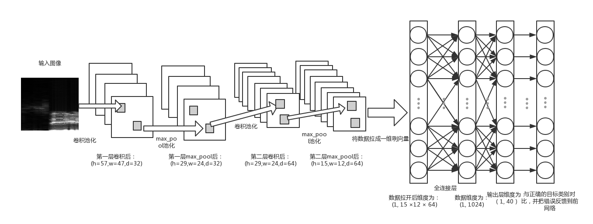
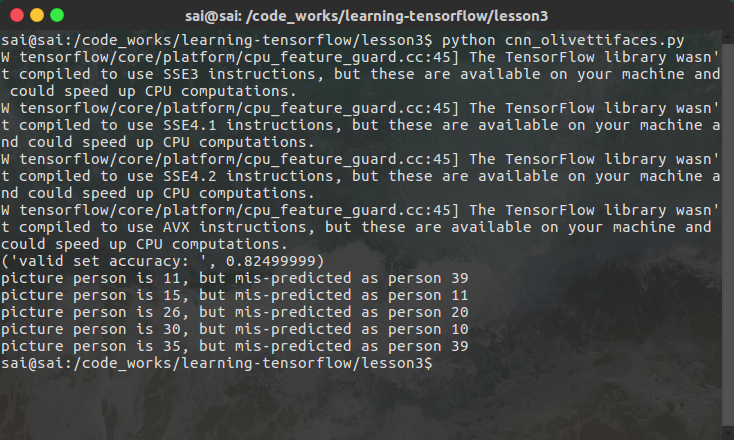
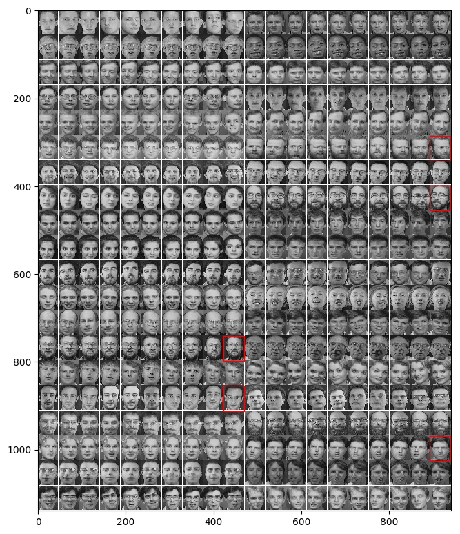

# 学习Tensorflow的内容

鄙人通过阅读Tensorflow的[programmers_guide](https://www.tensorflow.org/programmers_guide/)。我编写（抄）当中的代码和一些思想，为日后回忆和记录做做准备。

## Lesson1:
使用基本的创建模型、创建变量和保存模型

## Lesson2:
在Tensorflow中使用队列，组织输入数据并转变为批量的格式化数据。这样是为了加快Tensorflow的吞吐数据量。

## Lesson3 (CNN之图像人脸识别):

利用olivettifaces.gif数据训练“人脸识别”，准确来说仅仅是一个“人脸分类”。

设计的网络是基于CNNs，

最后的结果：

## Lesson4 (RNN之LSTM实现):
使用Tensorflow重新实现一遍LSTM的结构

利用自己的建立的LSTM模型训练并学习一小段英文文章，最后自己生成一段英文文字。完成基本的语言模型。

## Lesson5 (RNN之生成唐诗):

给定一批唐诗，我们利用LSTM训练这些唐诗当中字之间的前后关系，建立简单的唐诗语言模型。

## Lesson6 (DQN，失败之作):

利用DQN训练机器人学习玩智障的打球游戏，但是效果并不明显。正在寻找原因

## Lesson7 (GANs，利用对抗神经网络)：

利用EBGANs模型学习给定的明星照片并且生成一些伪明星照片。但可以跑起来，但是不能利用TF的共享变量来提升代码质量，待解决。

